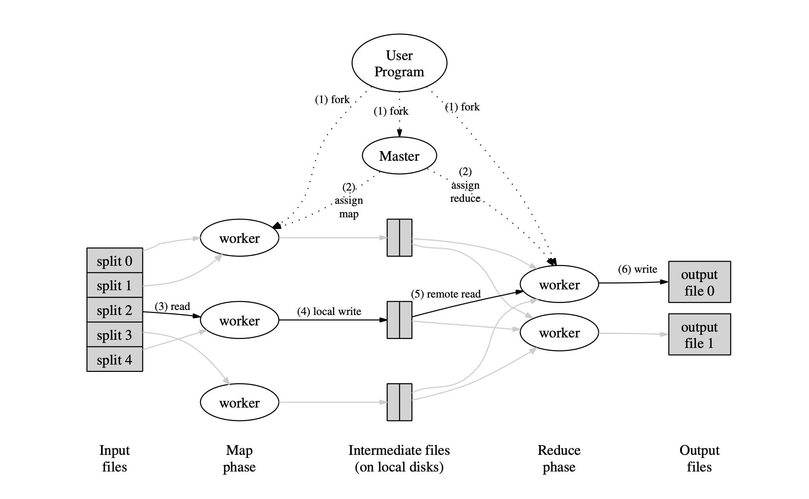

# Map Reduce Framework

## Introduction

Implement a basic distributed Map-reduce framework with handling Worker failure. Used Go programming language.

## What is Map Reduce?

MapReduce is a programming model and an associated implementation for processing and generating large data sets. Users specify a map function that processes a key/value pair to generate a set of intermediate key/value pairs, and a reduce function that merges all intermediate
values associated with the same intermediate key. Many real world tasks are expressible in this model and can be seen in our project from the provided examples.

## Implementation

### Why Go lang?

Go is a statically typed, compiled programming language designed at Google. It is syntactically similar to C, but with memory safety, garbage collection, structural typing, and CSP-style concurrency, which are useful to us in our project.

With its garbage collection feature, Go eliminates some common classes of bugs. Go also has good support for threads (goroutines), and a nice RPC package, which are directly useful in this project. Threads and garbage collection work particularly well together, since garbage collection can eliminate programmer effort to decide when the last thread using an object has stopped using it.

### System Requirements

The system had the following requirements:

-   The system should handle worker failure in both map and reduce phase
-   Map tasks should run in parallel
-   Reduce tasks should run in parallel
-   Assume the coordinator does not fail

### System Architecture



### Implementation Details

From the above system architecture, we have implemented three main programs:

1. coordinator.go
2. worker.go
3. rpc.go

We assume that the input file is large enough and already split into smaller files which will then be given to the framework as input.

The total number of mappers is equal to the total number of input files while the number of reducers is an arbitrarily chosen number.

### `Coordinator.go`

Initially, the `coordinator.go` file is called, where the coordinator denotes the master in the architecture, along with the split input files. The coordinator is initialised having the following structure:

```go
type Coordinator struct {
	mapTasks    []mapTask  // list of structs containing total number of map tasks
	reduceTasks []reduceTask // list of structs containing total number of reduce tasks
	availableMapTasks map[int]int // map containing all available map tasks
	availableReduceTasks map[int]int // map containing all available reduce tasks
	mapDoneTasks    int // denotes the number of map tasks that are completed
	reduceDoneTasks int // denotes the number of reduce tasks that are completed
	mapLock    sync.Mutex
	reduceLock sync.Mutex
}
```

The master can handle multiple requests from the workers concurrently. To ensure proper synchronisation we use `mapLock` and `reduceLock` mutex locks. When a request from a worker is received, the master locks the worker and sends them a map task if available, else sends a reduce task and unlocks it. When a worker finishes their task, the master is notified and updates its variables accordingly. The master is also responsible for handling the worker failure which is described in detail in the next section.

### `worker.go`

The worker is initialised and given a random number as its workerID. It then sends an RPC call `callGetTask` to the coordinator to receive a task. Depending on the return value, it performs its task as a mapper or a reducer. If it receives ‘3’, it means that the entire MapReduce task has been completed and can now safely exit. Else the worker is asked to wait for some time until some task is available and assigned to the worker.

-   Mapper Task:

The mapper task is given in the `mapFunc` function:

The worker reads the input, which is one of the split input files given to the coordinator. Then the worker extracts the (key,value) pairs from the file content using the user provided `Map` function for the particular Map reduce application. It then sorts the pairs and creates an intermediate hashmap which maps an integer to a list of (key,value) pairs, the integer here is the hashed value of the key modulo with partitions where it is stored. Here, partitions are the number of reducer tasks. The intermediate hashmap is written onto intermediate files which are numbered based on the number of partitions and the mapper which wrote this file.

-   Reducer Task:

The reducer task is given in the `reduceFunc` function:

For each reducer, there are N intermediate files where (key,value) pairs are stored from the mapper. Here, N denotes the number of mappers. The reducer takes all the input files and parses the key,values and creates a mapping for each key to all the values that are present in the files. This map is given to the `Reduce` function provided by the user for the particular application, whose output is appended and given as final result.

Once the given task is completed, it sends an RPC to the coordinator to notify it.

### `rpc.go`

The file `rpc.go` contains the remote procedure calls that are used by the workers and the coordinator for communication. For each process (master or worker), a thread is created which is used specifically for listening to RPCs from workers or master.

### Handling worker failure

In a map reduce task a worker can often fail. This may be due to something like a system crash or a network failure. A map reduce framework should be robust enough to handle such failures. In our map reduce we assume that if a worker does not respond after 10 seconds of giving a task we assume it has crashed. This limit of 10 seconds can be tuned according to the task given. Now the coordinator puts the task of the failed worker in `availableMapTasks` or `availableReduceTasks` based on the type of the task and sets the worker assigned of the given task as `-1` . Eventually, when another worker requests a task, the coordinator will assign this task to a new worker. (Even if the crashed worker completes the task after 10 seconds we do not count it as a completed task and still re assign it). The following snippet of code handles the worker failure part:

```go
func waitCheck(c *Coordinator, taskType int, taskNum int) {
	time.Sleep(10 * time.Second)

	if taskType == 0 {
		c.mapLock.Lock()
		if !c.mapTasks[taskNum].done {
			defer fmt.Printf("Worker %v took too long to respond for map task %v\n",
				c.mapTasks[taskNum].worker, taskNum)
			c.mapTasks[taskNum].worker = -1
			c.availableMapTasks[taskNum] = taskNum
		}
		c.mapLock.Unlock()
	} else {
		c.reduceLock.Lock()
		if !c.reduceTasks[taskNum].done {
			defer fmt.Printf("Worker %v took too long to respond for reduce task %v\n",
				c.reduceTasks[taskNum].worker, taskNum)
			c.reduceTasks[taskNum].worker = -1
			c.availableReduceTasks[taskNum] = taskNum
		}
		c.reduceLock.Unlock()
	}
}
```

### Creating MR Apps

It is very convenient to create Map Reduce applications with our library. Just specify a file with two functions `Map` and `Reduce`. We use Go’s buildmode plugin feature to integrate the code with our library. To run the worker with a given Map Reduce application just run it with the correct plugin file. Here is an example to run the letter count program:

```bash
./mrworker letter-count.so
```

The code for `letter-count.go` program is as follows:

```go
package main

//
// a letter-count application "plugin" for MapReduce.
//
// go build -buildmode=plugin letter-count.go
//

import "mapreduce/mr"
import "unicode"
import "strconv"

func Map(filename string, contents string) []mr.KeyValue {
	kva := []mr.KeyValue{}
	for _, w := range contents {
        if !unicode.IsLetter(w) {
            continue
        }
		kv := mr.KeyValue{string(w), "1"}
		kva = append(kva, kv)
	}
	return kva
}

func Reduce(key string, values []string) string {
	// return the number of occurrences of this letter.
	return strconv.Itoa(len(values))
}
```

### Testing

We run a total of 9 tests to ensure the correctness of our implementation:

-   Word Count Problem
-   Inverted Index creation
-   Letter Count Problem
-   Map parallelism test: In the map phase each worker creates a file with its pid in the name. All workers scan the directory for pids and send a `KILL` syscall to figure out if they are running in parallel or not. Then the number of alive workers is sent to the reduce task. If the number of parallel workers found is equal to the number of worker processes started then the library passes the test.
-   Reduce parallelism test: Similar to the map parallelism in the reduce parallelism test each worker in the reduce phase creates a file with its pid in the name. All workers in the reduce phase scan the directory for pids and send a `KILL` syscall to figure out if they are running in parallel or not. The number of parallel task is sent to the output of reduce phase and is compared to be greater than a certain threshold.
-   Job Count test
-   Early exit test (tests whether any worker or coordinator exits before the task has been completed, and all output files have been finialized)
-   Crash test: The mapper and reducer randomly crashes. Checks if the output is still correct or not.

## References

-   MapReduce: Simplified Data Processing on Large Clusters [https://static.googleusercontent.com/media/research.google.com/en//archive/mapreduce-osdi04.pdf](https://static.googleusercontent.com/media/research.google.com/en//archive/mapreduce-osdi04.pdf)
